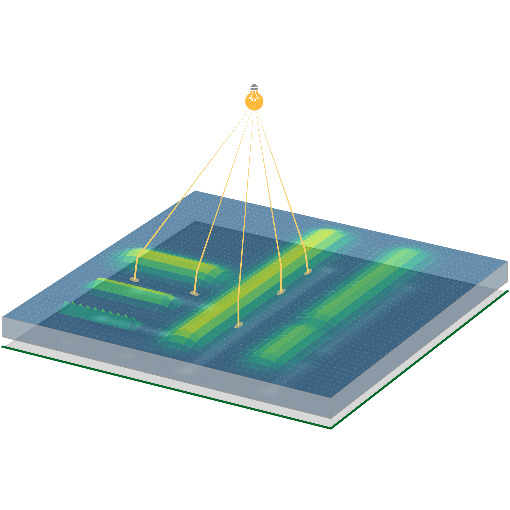

# Shape from Caustics


&nbsp;&nbsp;[](https://opensource.org/licenses/MIT)



Official PyTorch implementation of the main ideas described in our paper [Shape from Caustics: Reconstruction of 3D-Printed Glass from Simulated Caustic Images](https://graphics.tu-bs.de/publications/kassubeck2020shape).

## Prerequisites


- [NVidia OptiX 6.5](https://developer.nvidia.com/designworks/optix/downloads/legacy)
- [PyTorch >= 1.7](https://pytorch.org/)
- [PyWavefront](https://pypi.org/project/PyWavefront/)
- [PyTorch Wavelets](https://github.com/fbcotter/pytorch_wavelets) (for using wavelet sparsity)
- [PyWavelets](https://pywavelets.readthedocs.io/en/latest/install.html)
- [Matplotlib](https://matplotlib.org/stable/users/installing.html#installing-an-official-release)
- [tqdm](https://github.com/tqdm/tqdm)
- [Tensorboard](https://www.tensorflow.org/tensorboard)
- [PyMongeAmpere](https://github.com/mrgt/PyMongeAmpere) (for running the reimplementation of [High-contrast computational caustic design](https://dl.acm.org/doi/10.1145/2601097.2601200))

## Setup

First build the necessary OptiX `.ptx` files; we have provided a `CMakeLists.txt` file for this task (which should also be automatically invoked, when executing `setup.py`). 
To get the files into the correct location, the `install` Target has to be called:

```
mkdir build && cd build
cmake ..
cmake --build . --target install
```

Second build the PyTorch extensions by invoking `python setup.py install`. Be sure to change the paths in `setup.py` to the correct OptiX directory.

## Executing the code

If everything is set up correctly, you can call `python shape_from_caustics.py --help` to get an overview of the parameters for simulation and reconstruction. 
Alternatively you can also look at `hyperparameter_helper.py` to see, which parameters are available and which might take a list of arguments.
A call of `python shape_from_caustics.py` will start the simulation and reconstruction of a synthetic 3D printed glass sample with sensible initial parameters (for a GPU with 24GB VRAM).
If you have problems with `Out of memory` errors, try decreasing the `num_inner_simulations` parameter.
For a complete overview of parameters for the result in the paper, have a look at the [supplementary material](https://openaccess.thecvf.com/content/WACV2021/supplemental/Kassubeck_Shape_From_Caustics_WACV_2021_supplemental.pdf).

If you want to execute the reimplementation of [High-contrast computational caustic design](https://dl.acm.org/doi/10.1145/2601097.2601200), look at `schwartzburg_2014/ma.py` and change the paths therein to the respective paths of `PyMongeAmpere` and `cgal-python` as well as to the input and output images in `__main__`.
## Citation

If you use this code for your publications, please cite our [paper](https://graphics.tu-bs.de/publications/kassubeck2020shape) using the following BibTeX.

```
@inproceedings{kassubeck2020shape,
  title = {Shape from Caustics: Reconstruction of 3D-Printed Glass from Simulated Caustic Images},
  author = {Kassubeck, Marc and B{\"u}rgel, Florian and Castillo, Susana  and Stiller, Sebastian and Magnor, Marcus},
  booktitle = {{IEEE}/{CVF} Winter Conference on Applications of Computer Vision ({WACV})},
  pages = {2877--2886},
  month = {Jan},
  year = {2021}
}
```

## Acknowledgements

The authors would like to gratefully acknowledge funding from the German Science Foundation (DFG) under Germany’s Excellence Strategy within the Cluster of Excellence PhoenixD (EXC 2122, Project ID 390833453), and from the German Federal Ministry of Education and Research (grant No. 05M18MBA-MOReNet).